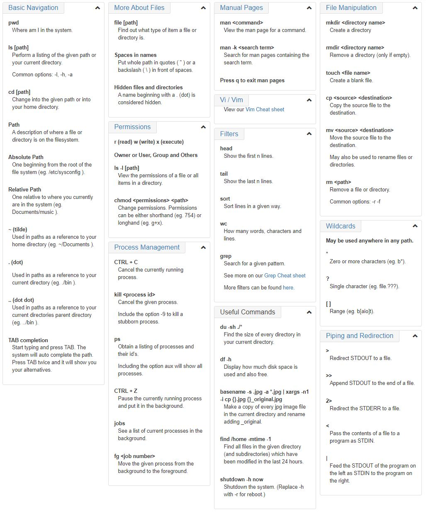

# Linux basic command line 
[Tutorials for Linux command line](https://ryanstutorials.net/linuxtutorial/commandline.php)

## Paths...
- ~(tilde): shortcut for home directory
- .(dot): reference to current directory
- ..(dotdot): referecc to parent directory
- /etc: Stores config files for the system
- /var/log: Stores log files for various system programs
- /bin: The location of several commonly used programs
- /usr/bin: Another location for programs on the system

## #ls [options] [location]
- Show the list
- Add '-l' long with it to see all files/ folders.
- Add '-a' long with it to see all non-hidden or hidden files/ folders with permision details.

## #echo
- Display strings 
- Add '$SHELL' to state current sheel

## #pwd
- Show current directory

## #cd [location]
- Go to specific directory

## #file
- Open a file
- If a file name has spaces, add 'quotes' or backslash ('\\') with spaces so that it can be opened.

## #man \<command to look up>
- Look up the manual page for particular command.
- man -k \<search term> 
  - Do a keyword search for all manual pages containing the given search term.

## #mkdir [options] \<Directory>
- Create a directory 

## #rmdir [options] \<Directory>
- Remove a directory

## #touch [options] \<filename>
- Create a blank file

## #cp [options] \<source> \<destination>
- Copy a file to specific directory

## #mv [options] \<source> \<destination>
- Move a file to specific dierectory
- We can also use this command to rename a file:
  - my [options] [current file name] [new file name]

## #rm [options] \<file>
> Attention: there is no undo feature for this command. BE CAREFUL if you want to use this.
- Remove a file
- Add '-r' along with it can delete directories with all files/directories contained within.

Cheat Sheet

