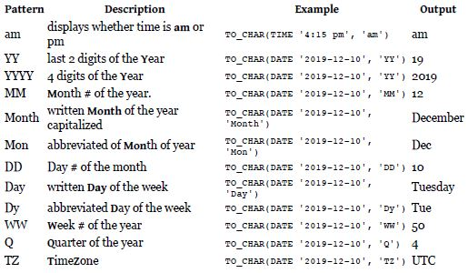

# Mid-Level SQL
## #WHERE
- WHERE can have conditions followed by it which is either true or false. 
- e.g. SELECT * FROM studens WHERE name = 'Brenda'

| Operator |	Condition	Example |
| ----- | ----- |
| = | Case sensitive exact string comparison (notice the single equals)	col_name = "abc" |
|!= or <>	|Case sensitive exact string inequality comparison	col_name != "abcd" |
| LIKE	|Case insensitive exact string comparison	col_name LIKE "ABC" |
|NOT LIKE	| Case insensitive exact string inequality comparison	col_name NOT LIKE "ABCD" |
| %	| Used anywhere in a string to match a sequence of zero or more characters (only with LIKE or NOT LIKE)	col_name LIKE "%AT%" (matches "AT", "ATTIC", "CAT" or even "BATS") |
| _ |	Used anywhere in a string to match a single character (only with LIKE or NOT LIKE)	col_name LIKE "AN_"(matches "AND", but not "AN") |
| IN (…)	|String exists in a list	col_name IN ("A", "B", "C") |
| NOT IN (…)	|String does not exist in a list	col_name NOT IN ("D", "E", "F") |

## #AND
- If you have multiple conditions that are all needed to be matched, AND can be put after WHERE to connect to conditions.

## #OR
- Multiple conditions that only either one needs to be matched, use OR after WHERE.

## #NOT
- Opposite to AND, select the data only when the condition(s) is not matched.

## Math Operators
- = equal
- < less than
- \> greater than
- <= less than or equal
- \>= greater than or equal
- != not equal
- <> not equal

## String Operators
- LIKE : a string matches a pattern
  - _ : matches any single character
  - % : matches any number of characters
- ILIKE : case insensitive version of LIKE (in other word, don't care about upper/lower case)
- SIMILAR TO : a string matches a reges pattern

## NULL
- IS NULL : matches NULL values
- IS NOT NULL : matches all non NULL values

## #COUNT()
- Count selected items
- COUNT DISTINCT : 
  - Add DISTINCT clause to eliminate the repetitive appearance. 
  - e.g. COUNT(DISTINCT expr,[expr...])

## #AS
- Give a new key word for selected item
## #MAX
- Return the largest number in a sets
## #MIN
- Return the smallest in a sets
## #EVERY
- Return **true** if all data inside is true
## #AVG
- Return the average of the set of numbers
## #SUM
- Return the sum of all the values in the set
## #GROUP BY
- Tell the database how to group a result set

# JOIN Relationships- Combine tables to see relationships
## Primary key
> A column in a table that has a **unique identiifier** for each row.
## Foreign key
> Columns in a table that specify a link to a primary key in another table.
## JOIN ... ON
- INNER: DEFAULT: returns only the rows where matches were found
- LEFT OUTER: return matches and all rows from the left listed table
- RIGHT OUTER: return matches and all rows from the right listed table
- FULL OUTER: return matches and all rows from both tables

# DATE and TIME functions
## There are four ways:
- TIMESTAMP: date & time
- DATE: date
- TIME: time
- INTERVAL: interval between two date/times
## ... and patterns:

PostgreSQL supports a number of special values, or functions to help bet the current
DATE, TIMESTAMP or TIME. The most used ones are
**CURRENT_DATE**
**CURRENT_TIME**
**CURRENT_TIMESTAMP**
and they are used by just putting them in the query
